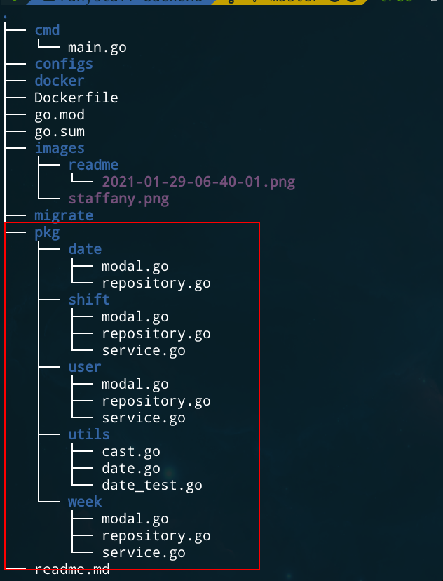

# Staffany backend

This is a very trivial implementation of a shift management system. 

## Requirements
- Build a backend service that allows users to create shifts within a specific time range.
- Users are able to see a list of shifts for , and they can update, delete their shifts.

## Technical details
### Database schema

#### Notes about the schema
- I store date as integer for fast querying and calculation. For example: "2021-29-01" -> 20212901
  
- **Shift** schema containing two fields:
  - quarterStart 
  - numQuarter

Every date is devided into quarters. Every hour takes up 4 quarters of 15 minutes.
So a date will take up a total of 24 * 4 = 96 quarters.

`numQuarter` is the total quarters that a shift expand. If `numQuarter` is 3 then the shift takes up 45 minutes.

`quarterStart` specifies the beginning of a shift. If a shift has `quarterStart` of 0 then It start at 0 * 15 minutes = 0:00.

Examples:
| quarterStart  | corresponding time   |
|---|---|
|  0 | 0:00  |
|  1 | 0:15  |
|  2 | 0:30  |
|  3 | 0:30  |
| 4 | 1:00  |

### API 
| Method      | API path 	| Description| 
| ----------- | ----------- | -----------|
|POST 			| /api/v1/users/sign_up      | Sign up |
|POST | /api/v1/users/login        | Login |
|POST | /api/v1/weeks            | Create a week |
|GET  | /api/v1/weeks/current_week/:user_id| Get current week including all dates and shifts for a user |
|POST | /api/v1/weeks/:id/shifts   | create a shift for a specific week |
|PUT  | /api/v1/shifts/:id         | Update a shift |
|DELETE|/api/v1/shifts/:id       |Delete a shift |

Response sample: get current week of user with id `1` `/api/v1/weeks/current_week/1`
```json
{
   "id":1,
   "created_at":"2021-01-28T23:26:45.27Z",
   "updated_at":"2021-01-28T23:26:45.27Z",
   "week_number":4,
   "start_date":20210125,
   "is_published":false,
   "user_id":1,
   "dates":[
      {
         "id":1,
         "created_at":"2021-01-28T23:26:46.249Z",
         "updated_at":"2021-01-28T23:26:46.249Z",
         "date":20210125,
         "week_id":1,
         "user_id":1,
         "is_published":false,
         "shifts":[    
         ]
      },
      {
         "id":2,
         "created_at":"2021-01-28T23:26:47.135Z",
         "updated_at":"2021-01-28T23:26:47.135Z",
         "date":20210126,
         "week_id":1,
         "user_id":1,
         "is_published":false,
         "shifts":[
            {
               "id":302,
               "created_at":"2021-01-28T23:39:40.964Z",
               "updated_at":"2021-01-28T23:39:40.964Z",
               "date_id":2,
               "user_id":1,
               "quarter_start":8,
               "num_quarter":4,
               "title":"Default title",
               "description":""
            },
            {
               "id":303,
               "created_at":"2021-01-28T23:39:42.284Z",
               "updated_at":"2021-01-28T23:39:42.284Z",
               "date_id":2,
               "user_id":1,
               "quarter_start":8,
               "num_quarter":4,
               "title":"Default title",
               "description":""
            }
         ]
      }
}
```


### Technical choices
- I use Golang for building backend service, because I'm most productive and comfortable with it.

- I use MySQL relational database for building relations between tables because I'm more comfortable with MySQL and it will better in terms of productivity for me. But I think MongoDB is a better fit for the project. If I need to build this in real world, I would use MongoDB with no doubt.


### Project structures
I structured the project following a template below. It's very recommended in the golang community
https://github.com/golang-standards/project-layout


In the folder `cmd` contain the root file of the project where everything will be bootstrapped here.



The `pkg` contains contains code for business logic. 
 - A `modal` defines the schema of a business domain.
 - a `repository` provide an interface to interact with the database
 - a `service` contains the restful API implementation and routing logic, A service takes in `repository` to interact with the DB


### Architecture and patterns
I apply [clean](https://blog.cleancoder.com/uncle-bob/2012/08/13/the-clean-architecture.html) architecture with Repository pattern to the project.


At the `service` layer we can use HTTP or gRPC or even graphQL depending on the situation.

`Repository` provide interfaces for us to interact with any kind of database.
I use MySQL for the project but I can replace it with MongoDB or Redis easily later on. It also make easier for us to write unit tests by creating mocks that implement a `Repository` without us having to setting up the real database.


## How to run the project
- Step 1: Set up a mySQL database with docker
```
$ docker run --name mysql \
-p 3306:3306 \
-e MYSQL_ROOT_PASSWORD=123456 \
-d mysql \
--default-authentication-plugin=mysql_native_password
```
- Step 2: Connect to the database to create a database for the project
```
$ docker exec -it mysql /bin/bash
$ mysql -u root -p
<enter 123456>
> create database staffany;
```
- Step 3: open `.env` file, edit the param `DB_DSN` if you make change to the database name
```
DB_DSN=root:123456@tcp(localhost:3306)/staffany?charset=utf8mb4&parseTime=True&loc=Local
```
- Step 4: run the project. Make sure that you have [golang](https://golang.org/) installed on your machine 
```
$ go run cmd/main.go
```

## Final thoughts
I was having fun doing the asssessment but due to the time limitation, I write a bunch of hacky code and don't have to time to write unit tests. The code doesn't cover all the edge cases and there might be bugs. This is not what my code will look like in a professional manner.


